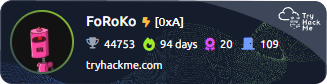

# Hi there 👋

I am a cybersecurity and automation enthusiast.

## 🔭 I’m currently working on:

### [Ws-stats.pl](https://ws-stats.pl)

  
Learn more

  This is a Node.js web application that displays detailed match summaries from War Selection game replay code. The goal of this project is to create a platform that allows players to analyze their gameplay and improve their strategies.

### [Chess Game Chessagon](https://github.com/FoRoKo1o/ChessagonClient)

  
Learn more

  Chessagon is a hexagonal chess game built using JavaScript and .Net

## Check out my cybersecurity progress 🛡️

I'm actively learning and improving my cybersecurity skills. Here's my latest badge from **TryHackMe**:

**Daily updated badge** - [Learn More](https://github.com/FoRoKo1o/TryHackMeBadgeUpdate)

<!--
**FoRoKo1o/FoRoKo1o** is a ✨ _special_ ✨ repository because its `README.md` (this file) appears on your GitHub profile.

Here are some ideas to get you started:

- 🌱 I’m currently learning ...
- 👯 I’m looking to collaborate on ...
- 🤔 I’m looking for help with ...
- 💬 Ask me about ...
- 📫 How to reach me: ...
- 😄 Pronouns: ...
- ⚡ Fun fact: ...
-->

